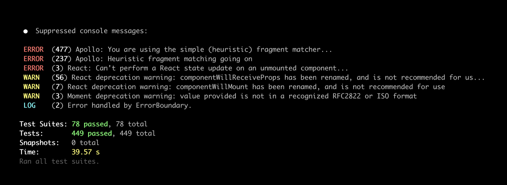

# jest-clean-console-reporter (alpha)

_A custom Jest reporter to reduce `console` spam in your test output._

---

Remember back in the day when [Jest](https://jestjs.io/) used to swallow `console.log` messages by default, and it was basically impossible to figure out why your code was failing under test? \***Sigh\***. Those were the days.

Now that Jest prints all console messages, whether from our own code, third-party framework code, or the test runner itself, we have the opposite problem: **It's easy to lose actually important warnings among noise.**

The `jest-clean-console-reporter` reporter collects all console messages written by the test process, and allows you to group them by known error warning types, or ignore them outright.



## Stating the obvious

**The best way to remove warnings in your code is to address their root cause.**

This reporter is probably best used when filtering out spammy library warnings that are otherwise tricky or impossible to get rid of, or ignoring intentional user-facing warnings of your own project.

## Usage

Install with your favorite package manager:

```sh
npm install --save-dev jest-clean-console-reporter
```

You'll also need Jest 25.1 or later installed in your project.

### Configuration

```js
// List known warnings you want to group or suppress. See docs below.
// Tip: This is just an array, you can import it from an external file
const rules = [
  {
    match: /^You are using the simple \(heuristic\) fragment matcher/,
    group: "Apollo: You are using the simple (heuristic) fragment matcher.",
  },
  {
    match: /^Heuristic fragment matching going on/,
    group: null, // ignore outright
  },
  {
    match: /^Warning: An update to (\w*) inside a test was not wrapped in act/,
    group: "React: Act warnings",
    keep: true, // include in summary, but also keep raw console output
  },
];

// Add reporters to your jest config
module.exports = {
  // ...

  reporters: [
    // Add jest-clean-console-reporter. This takes place of the
    // default reporter, and behaves identically otherwise
    ["jest-clean-console-reporter", { rules: rules }],

    // Overriding config.reporters wipes out default reporters, so
    // we need to restore the summary reporter.
    //
    // NOTE: For jest 26.6.1 or older, this file is located at
    // @jest/reporters/build/summary_reporter
    "@jest/reporters/build/SummaryReporter",
  ],
};
```

## Options

Pass options to the reporter in your jest configuration as follows:

### Using Jest 26.6.2 or newer

```js
const jestConfig = {
  reporters: [
    ["jest-clean-console-reporter", options], // <--
    "@jest/reporters/build/SummaryReporter",
  ],
};
```

### Using Jest 25.1.0-26.6.1

```js
const jestConfig = {
  reporters: [
    ["jest-clean-console-reporter", options], // <--
    "@jest/reporters/build/summary_reporter",
  ],
};
```

### `options.rules`

Rules tell the reporter which console messages should be filtered, and how
they should be grouped in the summary.

Each rule has three options, `match`, `group` and (optionally) `keep`.

#### `rule.match : RegExp | string | (message, level, origin) => boolean`

`match` is either a regular expression, a string, or a predicate function:

- `RegExp`: Matches console message against this regular expression.
- `string`: Matches console message against this string, first using literal `===` comparison, and falls back to regular expression comparison using `message.match(match)`. The latter is not recommended, but useful if you need to serialize your regular expressions.
- A predicate function that's called with `match(message, level)` where
  - `message` is the full console message
  - `level` is the log level (error, warning, log etc..).
  - `origin` is the stack trace string for this error. Useful if you want to ignore all errors from a certain library, for example. Note that this string can contain newlines, so any regexes used to match it should use the `/g` flag.
  - To match this message, the predicate may return any truthy value.

Rules are matched in order, from top down. A message that is not matched by any rule will be displayed in the Jest test output as normal.

Matched messages are grouped according to the `group` property:

#### `rule.group : string | null | (message, level, matcher) => string | null`

`group` is either a string, a formatter function, or null:

- `string`: Matched messages are grouped by this literal string
- `null`: Matched message is ignored.
- Formatter function that's called with `group(message, level, matcher)` where
  - `message` is the full console message.
  - `level` is the log level (error, warning, log etc..).
  - `matcher` is the original matcher used to match this message. This can be useful if you want to e.g. execute the regular expression for capture groups.
  - The value returned by this function is used as capture key. If the function returns `null`, the message is ignored.

#### `rule.keep: boolean`

Setting `keep: true` option allows you to keep the original console output for this group intact, while also displaying it in the test run summary.

### options.levels

Define which log levels to display in the summary at the end of the test run:

Default: `["error", "warn", "info", "debug", "log"]`

These levels only affect the summary display, and have no effect on whether messages are matched. For that, see [Can I ignore all messages of certain log level?](#can-i-ignore-all-messages-of-certain-log-level).

## Never Asked Questions

Here are some questions nobody has ever asked, but might be helpful anyway.

### Can I ignore all messages of certain log level?

Yes. Use the second parameter passed to a function macher:

```js
{ match: (message, level) => level === "log", group: null }
```

### Can I ignore all messages, period?

Yes, but it's probably a bad idea:

```js
{ matcher: () => true, group: null }
```

### Can I group multiple error messages into the same bucket?

Yes, just give them the same group key:

```js
[
  {
    match: /^Warning: componentWillMount has been renamed/,
    group: "React componentWill* deprecation warnings",
  },
  {
    match: /^Warning: componentWillReceiveProps has been renamed/,
    group: "React componentWill* deprecation warnings",
  },
];
```

### Can I temporarily let a certain message through?

Yes, just set the rule's `keep` property to `true`:

```js
{
  match: /^Warning: An update to (\w*) inside a test was not wrapped in act/,
  group: "An update to (Component) inside a test was not wrapped in act",
  keep: true
}
```

### Can I use this with .json config?

You can use string matchers, which are first compared to the message as literal strings, and failing that, attempted to test against the message as regular expressions:

```json
{
  "match": "Warning: An update to \\w* inside a test was not wrapped in act",
  "group": "An update to (Component) inside a test was not wrapped in act"
}
```

### Can I parameterize log groups using regex capture groups?

You can use the grouping function, where the original matcher is provided as a third argument.

```js
{
    match: /^Warning: An update to (\w*) inside a test was not wrapped in act/,
    group: (message, _level, matcher) => {
      // Note: String.matchAll requires Node 12.x or higher
      const [match] = message.matchAll(matcher);
      return `React: An update to ${match[1]} was not wrapped in act.`;
    }
}
```

### Can I ignore random `console.error`s from a specific library?

Yes, `console.error` comes with an `origin` property that contains the full stack trace
at the time of logging, which you should be able to use to filter per library, or even per file and line!

The origin may not be available for other log types, so check it before you use it.

```js
  {
    match: (_message, _type, origin) =>
      origin && /node_modules\/rc-form\/lib\/createBaseForm/g.test(origin),
    group: 'rc-form validation warnings'
  },
```

### Can I help make this library better?

Yes, see [Contibuting](#contributing).

## Contributing

This software is very much at alpha stage. If you want to help, here are a few things that could be helpful:

- [ ] Write tests
- [ ] Convert project to TypeScript
- [ ] NPM scripts for workflows
- [ ] Don't override DefaultReporter
  - [ ] When I started hacking on this, I couldn't immediately see a way to suppress `result.console` from being printed by the DefaultReporter, so I overrode it. This is annoying, because it can't be used with other custom reporters now. But it occurs to me, that maybe if a custom reporter is installed in the pipeline **before** the default reporter, perhaps we could filter out console messages there. Tradeoff here would be that we would nuke the console for ALL other reporters, whereas now we only do it for DefaultReporter.
- [ ] Feature ideas
  - [ ] Allow to fail the test suite after a certain threshold is passed, e.g. `rule.failAfter`.
  - [ ] Provide better summary that shows errors by file/test (behind an option flag)
  - [ ] Show deltas (+/- change) since last run (would require caching)
- [ ] Known issues
  - [ ] When running Jest with a single file parameter (e.g. `jest src/file.js`), the reporter is not activated

## License

[MIT](LICENSE)
